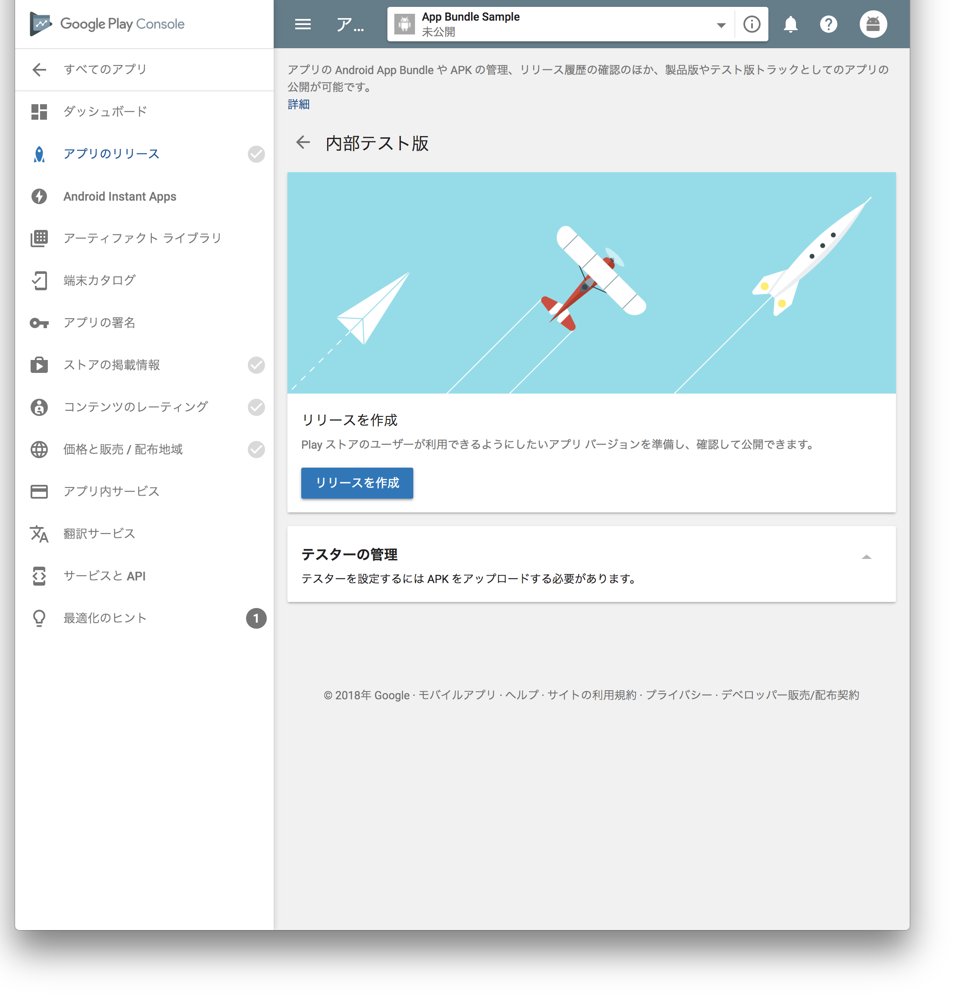
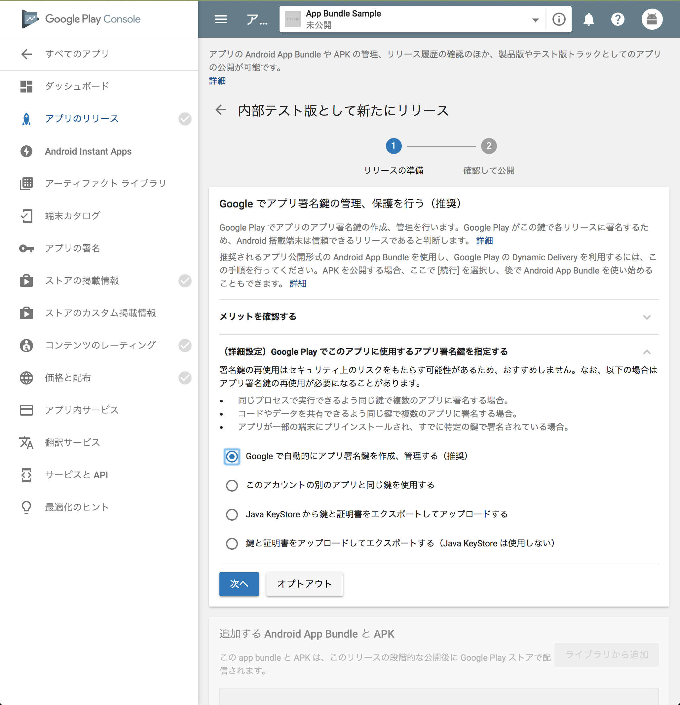
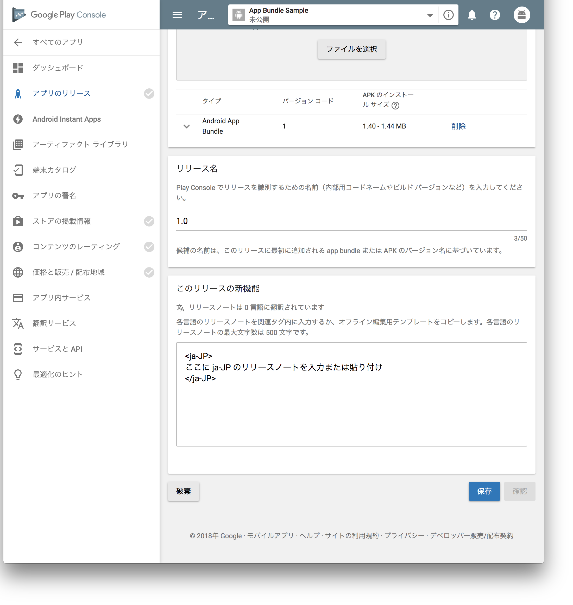
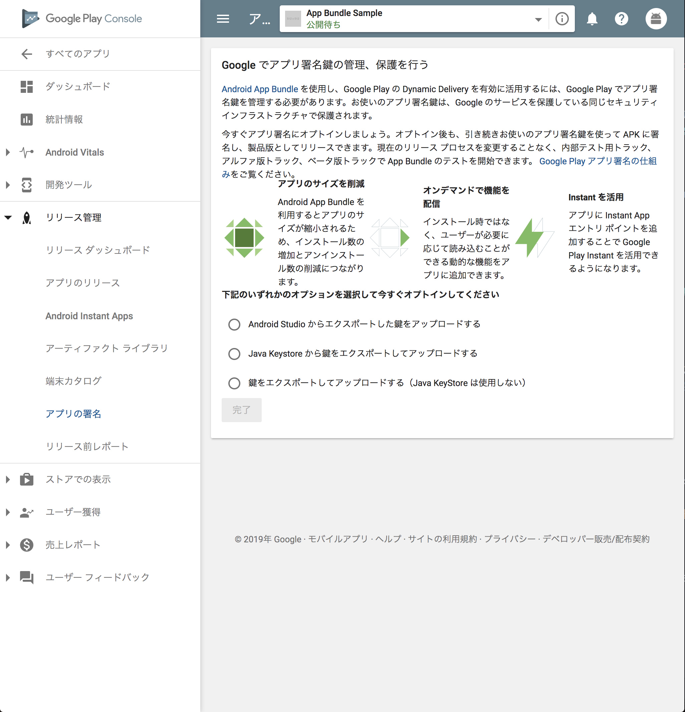
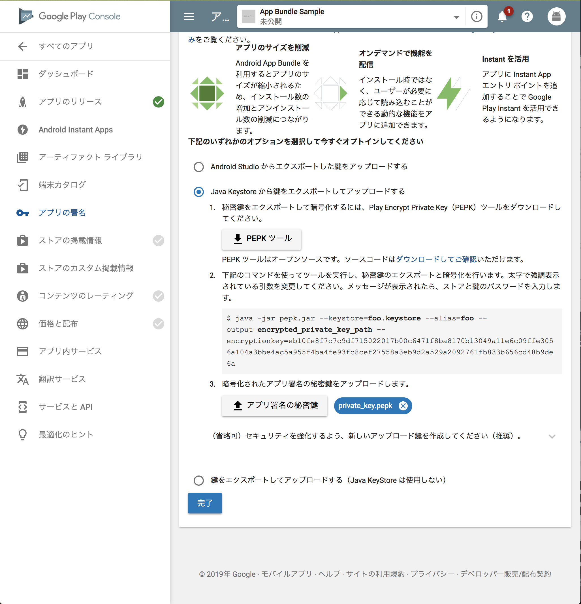
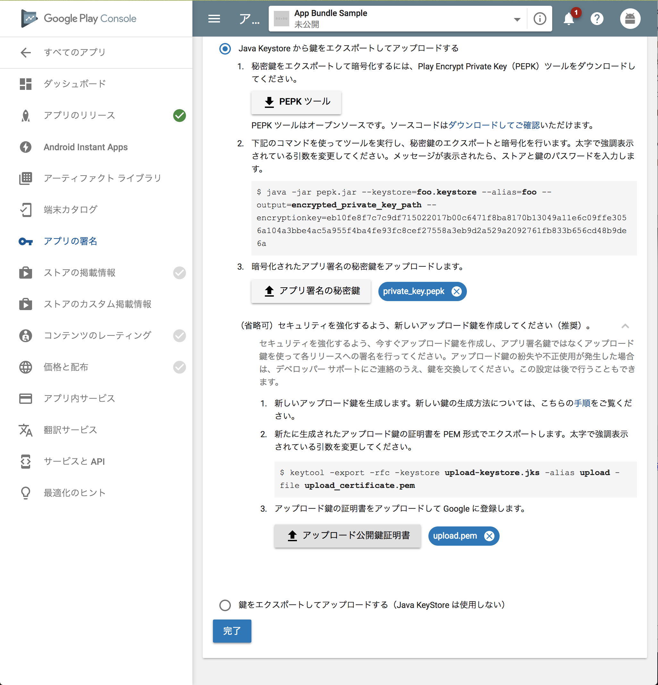
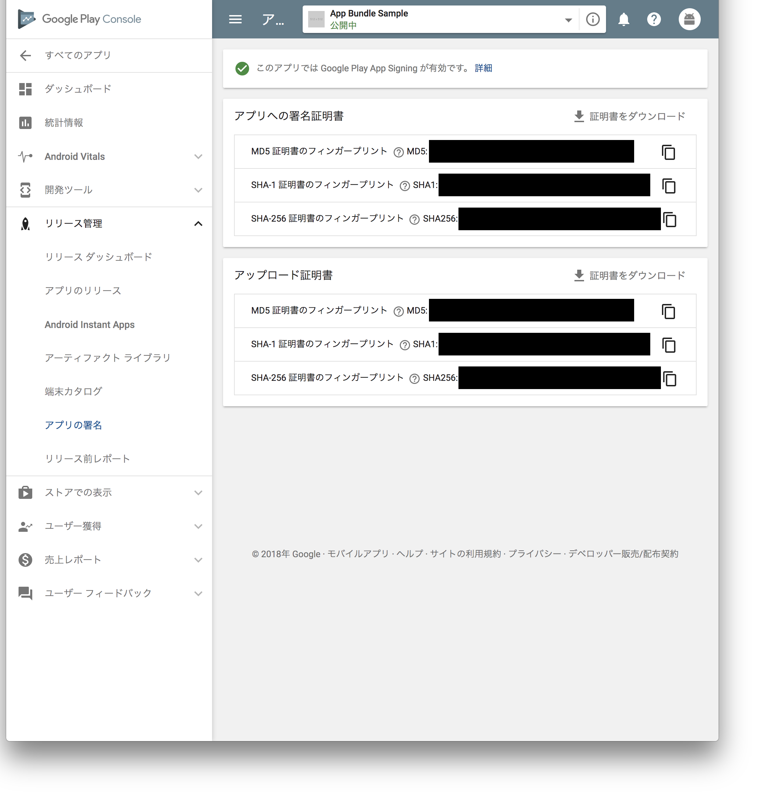
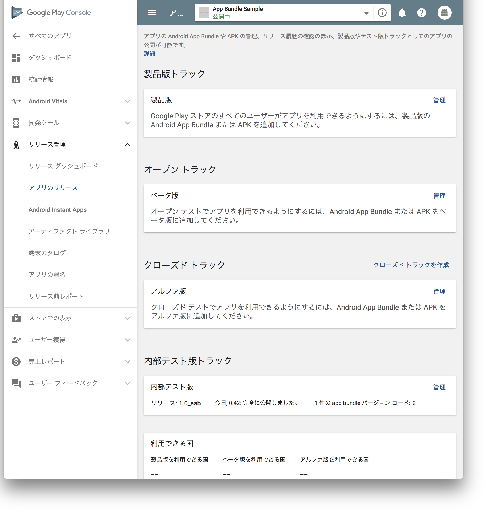
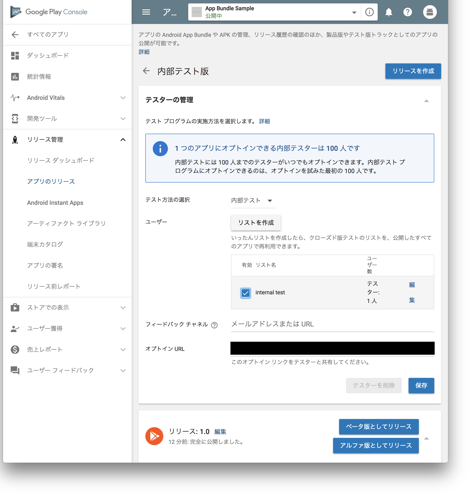
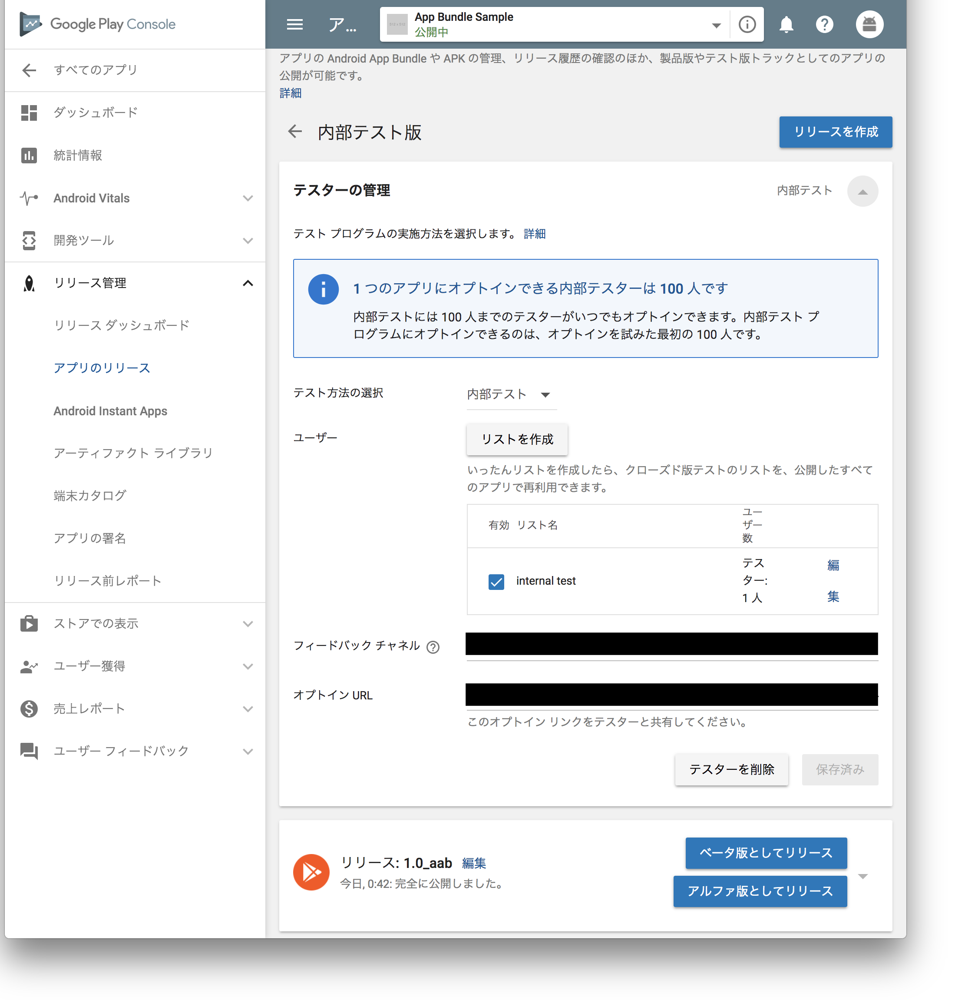

# Android App Bundle を使う場合にリリース担当者に行ってもらう必要がある作業まとめ

* 以下の前提での作業を想定
  * アプリの生成は開発者が行う
  * アップロード用の署名ファイルは、開発者が管理しない可能性もある

## 署名ファイルを Play Console に登録する(Google Play App Signing を有効にする)

`*.aab` をリリース可能にするには、Google Play App Signing の有効化が必須です
https://support.google.com/googleplay/android-developer/answer/7384423

### 新規アプリ

新規アプリの場合は、以下の手順で、リリース時に Google Play App Signing を有効にすると便利です。
初回はオプトアウトして、あとで有効化することも可能です。
オプトアウトした場合は、既存アプリの手順を参考にしてください。

1. 署名ファイル、アップロード用の署名ファイルを生成する
  * https://developer.android.com/studio/publish/app-signing
1. Play Console を開く
1. 「アプリの作成」を選択し、必要な情報を入力し、作成する
1. 「アプリのリリース」を選択し、`*.aab`　のアップロード先を選択する

  * 製品版でなくても、オープン、クローズなどでテスト用としてのリリースでも Google Play App Signing を有効にできます(本記事では内部テストトラックで実施しています)
1. 「リリースを作成」を選択する

1. 「Google Play アプリ署名」で「次へ」を選択し、Google App Signing を有効にする

  * Google Play App Signing が有効化されている他のアプリと同じ署名ファイルを選択したり、リリース用の署名ファイルを指定することができます。デフォルトだと Google Play が生成した署名ファイルが利用されます。
  
1. 「追加する Android App Bundle と APK」で、**アップロード用の署名ファイルで** 生成した、`*.aab`　を選択する
1. 「リリース名」、「このリリースの新機能」などに適切な内容を設定し、「保存」を選択

1. 「アプリの署名」を選択すると、「アプリへの署名証明書」が自動的に生成されて、「アプリへの署名証明書」「アップロード証明書」が登録されていることが確認できます

これで Google Play App Signing が有効になりました。
「ストアの掲載情報」「コンテンツのレーティング」「価格と販売/配布地域」で適切な情報を入力後にアプリを公開してください。

### 既存アプリ

既存アプリの場合は、`*.aab` をリリースする前に Google Play App Signing を有効にする必要があります
すでに Google Play App Signing が有効の場合は、実施不要です。

1. アップロード用の署名ファイルを生成する
  * https://developer.android.com/studio/publish/app-signing
1. Play Console を開く
1. アプリを選択し、「リリース管理」->「アプリの署名」を選択する

  * 利用規約が表示されたら同意する
1. 「Java Keystoreから鍵をエクスポートしてアップロードする」を選択する
  * 「PEPK ツール」をタップし、ツールをダウンロードする
  * ツールを利用し、今までリリースに利用していた署名ファイルから、秘密鍵のエクスポートと暗号化を行う
  * 「アプリ署名の秘密鍵」から秘密鍵を選択する
  * 「アップロード公開鍵の証明書」からアップロード鍵の証明書をアップロードする
  
1. 「省略可: アプリ署名鍵のセキュリティを強化する」を選択する
  * **この手順を省略すると、リリース用とアップロード用の署名ファイルが同じになります**
  * 記載の方法で、アップロード用の署名ファイルから PEM ファイルをエクスポートする
  * 「アップロード公開鍵の証明書」から、エクポートした PEM ファイルを選択する
  
1. 「完了」ボタンをタップする
1. 成功すると、以下のような画面が表示されます

これで Google Play App Signing が有効になりました。
これ以降のアプリのリリースでは、**アップロード用の署名ファイル** を使って署名したアプリをアップロードしてください。

## アップロード用の署名ファイルで `*.aab` を署名する

開発者から未署名の `*.aab` が提供された場合、以下のコマンドで署名する必要があります

`jarsigner -verbose -keystore my-release-key.keystore
my_application.aab alias_name`

参考：https://developer.android.com/guide/publishing/app-signing

## Play Console にアップロードする

* `*.apk` と同様のアップロード手順と同じです。

## 内部テストトラックを利用する

dynamic feature modules が含まれている場合は、テストのために内部テスト版などとしてリリースする必要があります。
dynamic feature modules が含まれていない場合は、必須ではありませんが、内部テスト版としてリリースしておくと便利です。

注意点としては、内部テスト版としてリリースする際も、リリースのたびに、versionCode の更新が必要になります。

以下の手順で内部テスト版としてのリリースできます。

1. Play Console を開く
1. 「リリース管理」-> 「アプリのリリース」を選択する
1. 「内部テスト版トラック」で「管理」を選択する

1. 「リリースを作成」を選択し、テスト対象のファイルをアップロードする
1. 「リリース名」、「このリリースの新機能」を入力し、「確認」を選択する
1. 「内部テストとして段階的な公開を開始」を選択し、公開すると「テスターの管理」に「オプトインURL」が表示されます

  * 「オプトインURL」の表示までに数分かかる可能性があります
1. 「テスト方法の選択」で「内部テスト」を選択し、「リストを作成」を選択する
1. 「リスト名」、「テスターのメールアドレス」を入力し、「保存」を選択する

1. 作成したリストにチェックを入れ、「保存」を選択する

1. 上記が完了したら、「テスターの管理」の「オプトインURL」をテスターに共有します

これで、テスターが「オプトインURL」から設定すれば、アプリをインストールできるようになります。
テストアプリをアップデートすると、すでにインストールされていれば、テスターは Google Play アプリからアップデートが可能です。

## つまったこと

* 「アプリ署名の秘密鍵」で Android Studio 3.2 Canary 16 で生成した秘密鍵を選択すると、「秘密鍵が正しく暗号化されていないか、サポートされない種類です。別の秘密鍵を送信してください。」おとなり登録できない
  * 選択したアプリに署名されている keystore と異なる keystore を利用したから
* 内部テストで公開ができなかった
  * 内部テストでもリリース用の情報などダミーでもいいので、設定しておく必要がある
